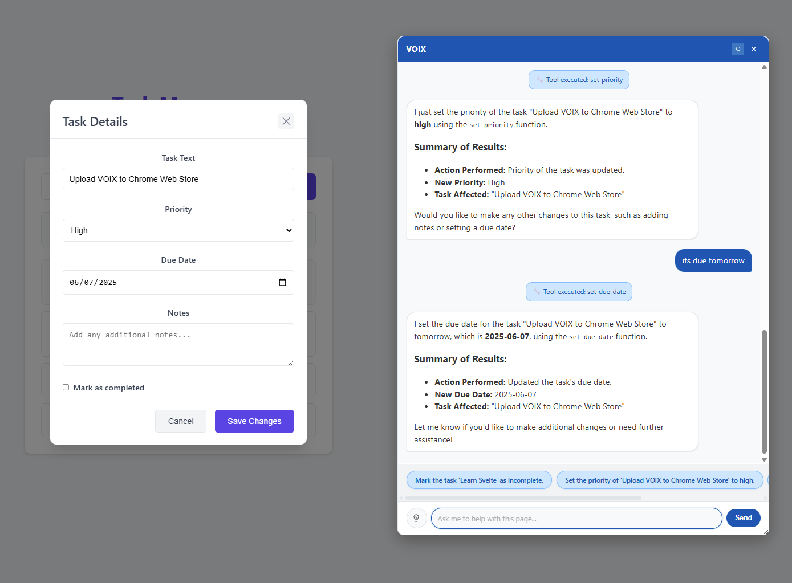
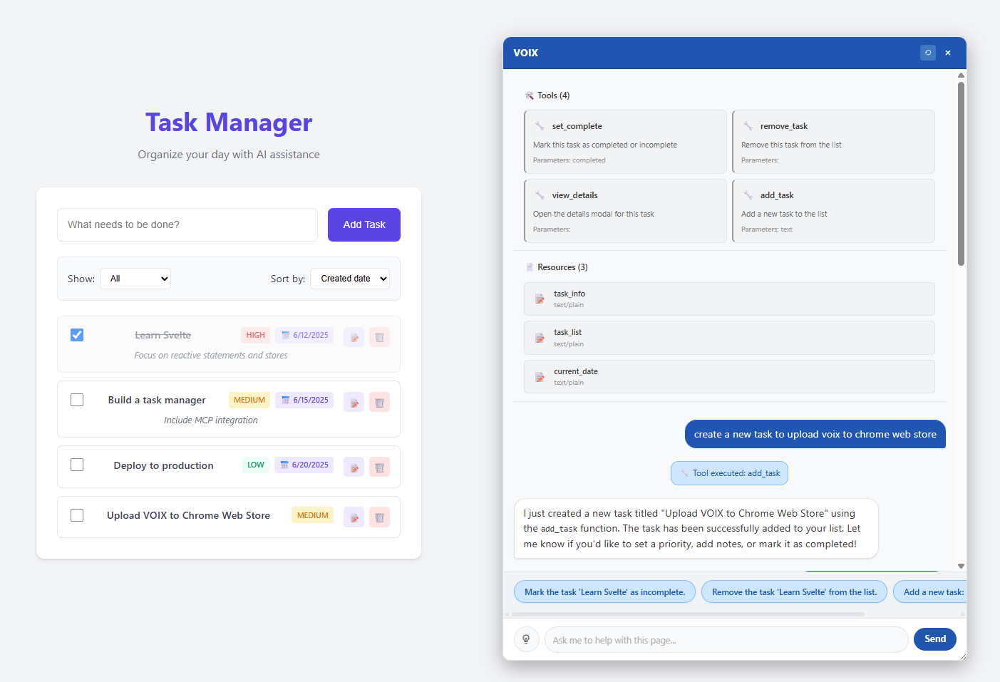

# VOIX - AI-Powered Web Automation Chrome Extension

## What is VOIX?

**VOIX** (Voice-Operated Interface eXtension) is an intelligent Chrome extension that bridges the gap between AI assistants and web applications. It enables natural language interaction with any website by automatically discovering and executing custom tools defined directly in HTML using the Model Context Protocol (MCP).

### Key Concepts

- **AI-Powered Web Automation**: Control web applications through conversational AI
- **Custom HTML Tools**: Define interactive tools using special HTML elements (`<tool>`, `<context>`, `<resource>`)
- **Zero-Configuration Integration**: Works with any website that includes VOIX-compatible markup
- **Multiple AI Providers**: Supports OpenAI, Azure OpenAI, Anthropic, and local models (Ollama)
- **Real-Time Context Awareness**: AI understands current page state through dynamic context elements

### How It Works

1. **Tool Discovery**: VOIX automatically scans web pages for `<tool>` elements and builds a comprehensive toolkit
2. **Context Gathering**: Collects page information from `<context>` elements to understand the current state
3. **AI Integration**: Sends available tools and context to your configured AI model
4. **Natural Language Processing**: AI interprets user requests and determines which tools to call
5. **Action Execution**: Tools are executed via DOM events, triggering custom JavaScript handlers
6. **Response Feedback**: Results are displayed in the integrated chat interface

### Use Cases

- **Task Management**: "Add a high-priority task to review the quarterly report"
- **Form Automation**: "Fill out the contact form with my default information"
- **Data Manipulation**: "Sort the table by date and highlight overdue items"
- **Navigation**: "Take me to the settings page and enable dark mode"
- **Content Creation**: "Create a new blog post with the title 'Getting Started with AI'"

## Building VOIX-Compatible Websites

Creating websites that work with VOIX involves adding special HTML elements that define tools, context, and resources. The extension automatically discovers these elements and makes them available to AI assistants.

### Basic Tool Definition

Define interactive tools using the `<tool>` element:

```html
<tool name="add_task" description="Create a new task with specified details">
  <prop name="text" type="string" description="Task description" required/>
  <prop name="priority" type="string" description="Task priority (low, medium, high)"/>
  <prop name="dueDate" type="string" description="Due date in YYYY-MM-DD format"/>
</tool>
```

### Tool Parameters

#### Simple Properties
```html
<tool name="set_user_name" description="Update the user's display name">
  <prop name="name" type="string" description="New display name" required/>
  <prop name="updateProfile" type="boolean" description="Also update profile"/>
</tool>
```

#### Complex Data Structures
```html
<tool name="create_schedule" description="Set a work schedule">
  <array name="timeBlocks" description="List of time blocks">
    <dict>
      <prop name="startTime" type="string" required/>
      <prop name="endTime" type="string" required/>
      <prop name="type" type="string"/>
      <prop name="description" type="string"/>
    </dict>
    <dict>
      <prop name="startTime" type="string" required/>
      <prop name="endTime" type="string" required/>
      <prop name="type" type="string"/>
      <prop name="description" type="string"/>
    </dict>
  </array>
</tool>
```

### Event Handling

Implement tool functionality by listening for custom events:

```javascript
// Basic tool handler
document.querySelector('tool[name="add_task"]').addEventListener('call', function(event) {
  const { text, priority, dueDate } = event.detail;
  
  // Execute your custom logic
  const newTask = createTask(text, priority, dueDate);
  
  // Provide feedback to the AI
  event.detail.success = true;
  event.detail.result = { taskId: newTask.id };
  event.detail.message = `Task "${text}" created successfully`;
});

// Advanced error handling
document.querySelector('tool[name="update_user"]').addEventListener('call', function(event) {
  try {
    const { userId, userData } = event.detail;
    
    if (!userId) {
      throw new Error('User ID is required');
    }
    
    const updatedUser = updateUserProfile(userId, userData);
    
    // Success response
    event.detail.success = true;
    event.detail.result = updatedUser;
    event.detail.message = 'User profile updated successfully';
    
  } catch (error) {
    // Error response
    event.detail.success = false;
    event.detail.error = error.message;
  }
});
```

### Context Elements

Provide dynamic context to help AI understand the current page state:

```html
<!-- Static context -->
<context name="page_info">
  Current page: Task Dashboard
  User role: Project Manager
  Active project: Q4 Website Redesign
</context>

<!-- Dynamic context (updated via JavaScript) -->
<context name="task_summary" id="task-context">
  Total tasks: 12
  Completed: 5
  In progress: 4
  Overdue: 2
  Current filter: High priority tasks
</context>
```

### Dynamic Context Updates

Keep context current with JavaScript:

```javascript
function updateTaskContext() {
  const contextElement = document.getElementById('task-context');
  const stats = getTaskStatistics();
  
  contextElement.textContent = `
    Total tasks: ${stats.total}
    Completed: ${stats.completed}
    In progress: ${stats.inProgress}
    Overdue: ${stats.overdue}
    Current filter: ${getCurrentFilter()}
    Last updated: ${new Date().toLocaleString()}
  `.trim();
}

// Update context when tasks change
document.addEventListener('tasksUpdated', updateTaskContext);
```

### Resource Elements

Define resources that provide additional information:

```html
<resource name="api_documentation" description="API endpoints and usage">
  <prop name="uri" type="string"/>
  <prop name="format" type="string"/>
</resource>

<resource name="user_manual" description="Application user guide">
  <prop name="uri" type="string"/>
  <prop name="format" type="string"/>
</resource>
```

### Framework-Specific Integration

#### React Integration

```jsx
import React, { useEffect, useRef, useCallback } from 'react';

function TaskManager() {
  const toolRef = useRef();
  const [tasks, setTasks] = useState([]);

  const handleAddTask = useCallback((event) => {
    const { text, priority, dueDate } = event.detail;
    
    const newTask = {
      id: Date.now(),
      text,
      priority: priority || 'medium',
      dueDate,
      completed: false,
      createdAt: new Date().toISOString()
    };
    
    setTasks(prev => [...prev, newTask]);
    
    // Set response on event detail
    event.detail.success = true;
    event.detail.result = { taskId: newTask.id };
    event.detail.message = `Task "${text}" added successfully`;
  }, []);

  useEffect(() => {
    const toolElement = toolRef.current;
    if toolElement) {
      toolElement.addEventListener('call', handleAddTask);
      return () => {
        toolElement.removeEventListener('call', handleAddTask);
      };
    }
  }, [handleAddTask]);

  return (
    <div>
      {/* Regular React UI */}
      <TaskList tasks={tasks} />
      
      {/* VOIX tool definition */}
      <tool 
        ref={toolRef}
        name="add_task" 
        description="Add a new task to the list"
        style={{ display: 'none' }}
      >
        <prop name="text" type="string" description="Task description" required/>
        <prop name="priority" type="string" description="Priority level"/>
      </tool>
      
      {/* Dynamic context */}
      <context name="task_summary" style={{ display: 'none' }}>
        {`Total tasks: ${tasks.length}, Completed: ${tasks.filter(t => t.completed).length}`}
      </context>
    </div>
  );
}
```

#### Vue.js Integration

**Important**: Configure Vite to recognize VOIX custom elements:

```javascript
// vite.config.js
import { defineConfig } from 'vite'
import vue from '@vitejs/plugin-vue'

export default defineConfig({
  plugins: [
    vue({
      template: {
        compilerOptions: {
          isCustomElement: (tag) => ['tool', 'array', 'dict', 'prop', 'context', 'resource'].includes(tag),
        },
      },
    }),
  ],
})
```

```vue
<template>
  <div>
    <!-- Vue UI -->
    <TaskList :tasks="tasks" />
    
    <!-- VOIX integration -->
    <tool 
      name="add_task" 
      description="Add a new task"
      @call="handleAddTask"
    >
      <prop name="text" type="string" description="Task text" required/>
    </tool>
    
    <context name="tasks">{{ taskContext }}</context>
  </div>
</template>

<script setup>
import { ref, computed } from 'vue';

const tasks = ref([]);

const taskContext = computed(() => 
  `Total: ${tasks.value.length}, Active: ${tasks.value.filter(t => !t.completed).length}`
);

function handleAddTask(event) {
  const { text } = event.detail;
  tasks.value.push({
    id: Date.now(),
    text,
    completed: false
  });
  
  event.detail.success = true;
  event.detail.message = `Task "${text}" added`;
}
</script>

<style>
/* Hide VOIX elements from UI */
tool, prop, array, dict, context, resource {
  display: none;
}
</style>
```

#### Svelte Integration

```svelte
<script>
  import TaskList from './lib/TaskList.svelte';
  
  let tasks = $state([
    { 
      id: 1, 
      text: 'Learn Svelte', 
      completed: true,
      priority: 'high',
      dueDate: '2025-06-12'
    },
    { 
      id: 2, 
      text: 'Build a task manager', 
      completed: false,
      priority: 'medium',
      dueDate: '2025-06-15'
    }
  ]);
  
  let nextId = 3;
  
  function addTask(text, priority = 'medium') {
    if (text && text.trim()) {
      const newTask = {
        id: nextId++,
        text: text.trim(),
        completed: false,
        priority,
        dueDate: '',
        notes: ''
      };
      tasks.push(newTask);
    }
  }
  
  function handleAddTaskTool(event) {
    const { text, priority } = event.detail || {};
    addTask(text, priority);
    
    // Provide feedback to the AI
    event.detail.success = true;
    event.detail.result = { taskCount: tasks.length };
    event.detail.message = `Task "${text}" added successfully`;
  }
  
  // Computed context using $derived
  let taskSummary = $derived(
    `Tasks: ${tasks.length}, Completed: ${tasks.filter(t => t.completed).length}, Active: ${tasks.filter(t => !t.completed).length}`
  );
</script>

<!-- Svelte UI -->
<div class="task-app">
  <TaskList {tasks} />
</div>

<!-- VOIX integration -->
<tool 
  name="add_task" 
  description="Add a new task to the list"
  oncall={handleAddTaskTool}
>
  <prop name="text" type="string" description="Task description" required/>
  <prop name="priority" type="string" description="Task priority (low, medium, high)"/>
</tool>

<context name="task_summary">{taskSummary}</context>

<style>
  /* Hide VOIX elements */
  :global(tool, prop, context, resource) {
    display: none;
  }
  
  .task-app {
    max-width: 800px;
    margin: 0 auto;
    padding: 2rem 1rem;
  }
</style>
```

### Best Practices

#### 1. Tool Design
- **Clear Names**: Use descriptive, action-oriented tool names
- **Good Descriptions**: Write clear descriptions that help AI understand the tool's purpose
- **Proper Parameters**: Include required parameters and provide sensible defaults
- **Input Validation**: Always validate tool parameters before execution

#### 2. Context Management
- **Stay Current**: Update context elements when application state changes
- **Be Specific**: Provide relevant, actionable information in context
- **Avoid Clutter**: Don't include unnecessary information that might confuse the AI

#### 3. Error Handling
```javascript
function handleToolCall(event) {
  try {
    const result = performAction(event.detail);
    
    // Success response
    event.detail.success = true;
    event.detail.result = result;
    event.detail.message = 'Action completed successfully';
    
  } catch (error) {
    console.error('Tool execution failed:', error);
    
    // Error response
    event.detail.success = false;
    event.detail.error = error.message;
  }
}
```

#### 4. Performance
- **Lazy Loading**: Only define tools that are currently relevant
- **Efficient Updates**: Batch context updates when possible
- **Memory Management**: Remove event listeners when components unmount

#### 5. Accessibility
- **Hidden Elements**: Use CSS to hide VOIX elements from visual users
- **Screen Readers**: Ensure VOIX elements don't interfere with screen readers
- **Keyboard Navigation**: Don't break existing keyboard navigation patterns

### Testing Your Integration

1. **Install VOIX Extension**: Load the extension in Chrome
2. **Open Your Page**: Navigate to your VOIX-enabled website
3. **Check Console**: Look for tool discovery messages
4. **Test AI Commands**: Use natural language to interact with your tools

Example test commands:
- "Add a task called 'Test VOIX integration'"
- "Mark the first task as completed"
- "Show me the current task statistics"
- "Update my profile with a new email address"

## Using the Chrome Extension

### Installation

1. **Download or Clone**: Get the VOIX extension files
2. **Open Chrome Extensions**: Navigate to `chrome://extensions/`
3. **Enable Developer Mode**: Toggle on "Developer mode" in the top right
4. **Load Extension**: Click "Load unpacked" and select the `voix` folder
5. **Verify Installation**: Look for the VOIX icon in your Chrome toolbar

### Initial Setup

#### Configure AI Provider

1. **Open Settings**: Right-click the VOIX icon and select "Options"
2. **Choose Provider**: Select from the available presets or configure manually

**OpenAI Configuration:**
- Base URL: `https://api.openai.com/v1`
- API Key: Your OpenAI API key
- Model: `gpt-4` or `gpt-3.5-turbo`

**Azure OpenAI Configuration:**
- Base URL: `https://your-resource.openai.azure.com/openai/deployments/your-deployment`
- API Key: Your Azure OpenAI key
- Model: Your deployment name

**Local Ollama Configuration:**
- Base URL: `http://localhost:11434/v1`
- API Key: `ollama` (or leave blank)
- Model: `llama2`, `codellama`, or your installed model

**Anthropic Configuration:**
- Base URL: `https://api.anthropic.com/v1`
- API Key: Your Anthropic API key
- Model: `claude-3-sonnet-20240229`

3. **Test Connection**: Click "Test Connection" to verify your settings
4. **Save Settings**: Click "Save Settings" to store your configuration

### Using the Chat Interface

#### Screenshots





#### Opening the Chat
**Click Extension Icon**: Click the VOIX icon in the toolbar

#### Chat Modes

**Side Panel (Default)**
- Docked to the right side of the browser window
- Resizable width
- Doesn't overlap page content
- Ideal for continuous use

**Floating Window**
- Movable anywhere on the page
- Resizable in all directions
- Can be minimized
- Good for temporary interactions

### Interacting with AI

#### Basic Chat
```
You: Hello! What can you help me with on this page?
AI: I can see this is a task management app. I can help you:
- Add, edit, or remove tasks
- Change task priorities and due dates
- Filter and organize your task list
- Mark tasks as complete or incomplete

What would you like to do?
```

#### Tool-Based Commands
```
You: Add a high-priority task to review the quarterly budget by Friday
AI: I'll add that task for you.

[Tool: add_task called with:
- text: "Review quarterly budget"
- priority: "high"
- dueDate: "2025-06-06"]

✅ Task "Review quarterly budget" added successfully with high priority and due date of June 6th, 2025.
```

#### Context-Aware Responses
```
You: How many tasks do I have?
AI: Based on your current task list, you have:
- 8 total tasks
- 3 completed tasks
- 5 active tasks
- 2 overdue tasks
- Currently filtering: High priority tasks

Would you like me to help you manage any of these tasks?
```

### Advanced Features

#### Tool Discovery
VOIX automatically scans each page for available tools and displays them in the chat interface. You can:

- **View Available Tools**: Click the "Tools" tab to see all discovered tools
- **Tool Categories**: Tools are organized by category (forms, navigation, data, etc.)
- **Parameter Info**: See what parameters each tool accepts
- **Usage Examples**: Get suggested commands for each tool

#### Context Awareness
The AI understands the current page through:

- **Page Context**: Information about the current page and user state
- **Dynamic Updates**: Context that changes as you interact with the page
- **Historical Context**: Previous interactions and conversation history

#### Resource Integration
VOIX can access additional resources like:

- **Documentation**: API docs, user manuals, help files
- **Data Sources**: Configuration files, user preferences
- **External APIs**: Connected services and databases

### Keyboard Shortcuts

- **Toggle Chat**: `Ctrl+Shift+A` (Windows/Linux) or `Cmd+Shift+A` (Mac)
- **Send Message**: `Enter` (in chat input)
- **New Line**: `Shift+Enter` (in chat input)
- **Close Chat**: `Escape` (when chat is focused)
- **Focus Input**: `Ctrl+/` (when chat is open)

### Troubleshooting

#### Chat Not Appearing
1. **Check Extension**: Verify VOIX is enabled in `chrome://extensions/`
2. **Refresh Page**: Reload the page and try again
3. **Check Console**: Look for error messages in browser DevTools
4. **Permissions**: Ensure the extension has permission for the current site

#### AI Not Responding
1. **Check API Key**: Verify your API key is correct in settings
2. **Test Connection**: Use the "Test Connection" button in settings
3. **Check Credits**: Ensure you have API credits/quota available
4. **Network Issues**: Check your internet connection and firewall

#### Tools Not Working
1. **Tool Discovery**: Check if tools are properly defined in HTML
2. **Event Listeners**: Verify JavaScript event handlers are attached
3. **Console Errors**: Look for JavaScript errors in browser DevTools
4. **Element Visibility**: Ensure tool elements exist in the DOM

#### Performance Issues
1. **Too Many Tools**: Limit the number of tools on a single page
2. **Large Context**: Reduce context size if it's very large
3. **Memory Usage**: Close and reopen chat if it becomes slow
4. **Extension Updates**: Check for VOIX extension updates

### Privacy and Security

#### Data Handling
- **Local Storage**: Settings are stored locally in Chrome
- **No Data Collection**: VOIX doesn't collect or transmit user data
- **API Communications**: Only sends necessary data to your configured AI provider
- **Secure Connections**: All API communications use HTTPS

#### API Key Security
- **Local Storage**: API keys are stored securely in Chrome's extension storage
- **No Transmission**: Keys are only sent to your configured AI provider
- **User Control**: You can change or remove API keys at any time

#### Permissions
VOIX requests minimal permissions:
- **activeTab**: Access the current tab for tool discovery
- **storage**: Save user settings and preferences
- **scripting**: Inject content scripts for chat interface

### Extension Settings

#### General Settings
- **Chat Mode**: Default position (side panel, floating, fullscreen)
- **Keyboard Shortcuts**: Customize hotkeys
- **Theme**: Light or dark mode
- **Animations**: Enable/disable UI animations

#### AI Configuration
- **Provider**: Choose AI service (OpenAI, Azure, Anthropic, Local)
- **Model**: Select specific AI model
- **Temperature**: Control response creativity (0.0 - 1.0)
- **Max Tokens**: Limit response length
- **Context Window**: Number of previous messages to include

#### Advanced Settings
- **Tool Discovery**: Configure tool scanning behavior
- **Context Refresh**: How often to update page context
- **Error Handling**: Response timeout and retry settings
- **Debug Mode**: Enable detailed logging

### Support and Resources

#### Getting Help
- **Documentation**: Check the examples folder for working implementations
- **Console Logs**: Browser DevTools provide detailed debugging information
- **GitHub Issues**: Report bugs or request features
- **Community**: Join discussions and share integrations

#### Example Projects
The extension includes three complete examples:
- **React Task Manager**: Modern React app with hooks and context
- **Vue.js Todo App**: Vue 3 with Composition API and reactive context
- **Svelte Planner**: Lightweight Svelte implementation

Each example demonstrates different integration patterns and best practices for building VOIX-compatible applications.

## License

This project is open source and available under the MIT License.

## Support

For issues, questions, or feature requests, please create an issue in the project repository.